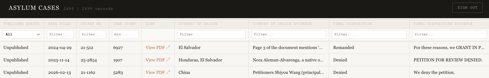
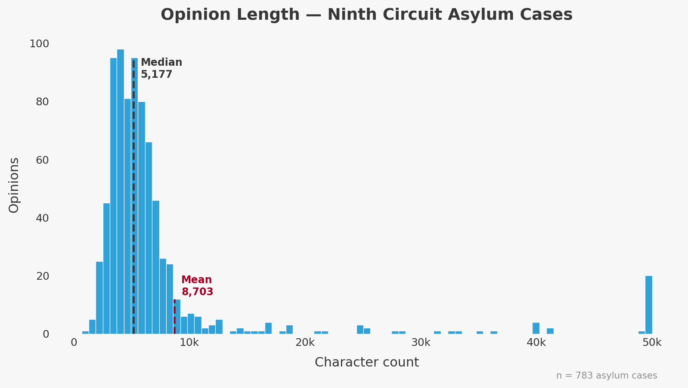

# Ninth Circuit Asylum Pipeline

Automated pipeline for collecting, classifying, and analyzing U.S. Court of Appeals for the Ninth Circuit asylum decisions.

## Architecture

```
ca9.uscourts.gov (RSS + HTML)
        |
        v
  [1. Fetch] ──> all_opinions table (every opinion)
        |
        v
  [2. Classify] ──> Free LLMs (OpenRouter/NVIDIA/Cloudflare/Groq/HuggingFace) mark asylum_related = true/false
        |
        v
  [3. Extract] ──> asylum_cases table (70+ legal features per case)
        |
        v
  Supabase ──> asylum-viewer (Next.js)
```

**Data sources:**
- Published opinions: `ca9.uscourts.gov/opinions/` (RSS + scrape)
- Unpublished memoranda: `ca9.uscourts.gov/memoranda/` (RSS + scrape)

**Classification:** Free-tier LLMs via GitHub Actions (OpenRouter, NVIDIA, Cloudflare, Groq, HuggingFace) — no cost per call.

**Extraction:** Free-tier LLMs (Groq, HuggingFace) for structured feature extraction from asylum cases. Gemini 2.5 Pro was used historically but is no longer active.

**Why two separate AI steps?** Classification is a cheap yes/no call (~3,250 tokens). Extraction is expensive — it returns evidence quotes for 60+ fields (~6,900 tokens, mostly output). Since ~74% of opinions are not asylum-related, running extraction on everything would be ~4x more expensive. The two-step filter keeps costs low.

**Historical Gemini costs** (Gemini 2.5 Pro: $1.25/1M input tokens, $10/1M output tokens):

| Operation | Tokens (avg) | Cost per 100 calls |
|-----------|-------------|-------------------|
| Extract | ~6,900 (output-heavy) | ~$3.50 |

All classification and extraction now uses free-tier LLMs. Gemini 2.5 Pro was used for the initial extraction run — observed spend: about $36 for 769 extractions ($27 extract, $9 GCP infrastructure).

## Database

Three tables in Supabase:

| Table | Purpose |
|-------|---------|
| `all_opinions` | Every Ninth Circuit opinion with metadata and asylum classification |
| `asylum_cases` | Asylum cases only, with 70+ extracted legal features |
| `extraction_runs` | MLflow backend tables (experiments, runs, params, metrics, artifacts) |

## Project Structure

```
pipeline/          Core pipeline (fetch, classify_free, extract, backfill)
lib/               Shared utilities (Supabase client, Gemini client, config)
cloud/             GCP deployment (Dockerfile, deploy.sh, Cloud Run entry points)
experiments/       MLflow experiment tracking (local server startup script, artifacts)
asylum-viewer/     Next.js frontend (deployed on Vercel)
logs/              Per-provider CSV logs of classifier runs
```

## Setup

### 1. Create a virtual environment

```bash
python3 -m venv ninthc
source ninthc/bin/activate
pip install -r requirements.txt
```

### 2. Set environment variables

Copy `.env.example` to `.env` and fill in your values:

```bash
cp .env.example .env
```

Required variables:
- `SUPABASE_URL` — Your Supabase project URL
- `SUPABASE_SECRET_KEY` — Supabase service-role key (admin access)
- `GCP_PROJECT_ID` — Google Cloud project ID
- `GCP_REGION` — GCP region (default: us-central1)

### 3. Run database migrations

Execute the SQL files in `db/migrations/` in order via the Supabase SQL editor.

## Usage

### Run the full pipeline locally

```bash
set -a && source .env && set +a
source ninthc/bin/activate
python3 cloud/main.py
```

### Run individual steps

```bash
set -a && source .env && set +a && source ninthc/bin/activate

# Fetch new opinions from ca9.uscourts.gov
python3 -m pipeline.fetch

# Classify pending opinions (free-tier LLMs)
python3 -m pipeline.classify_free --limit 10

# Extract features from asylum cases
python3 -m pipeline.extract --limit 5

# Backfill historical data
python3 -m pipeline.backfill --start-date 2020-01-01 --end-date 2025-12-31
```

## Scheduling

All scheduled jobs run on GitHub Actions (free). The pipeline sends a SendGrid email after each classify job.

| Job | Schedule (UTC) | What it does |
|-----|----------------|--------------|
| `fetch` | Daily 15:00 | Scrape new opinions from ca9.uscourts.gov |
| `classify_nvidia` | Daily 17:00 | Classify new opinions via NVIDIA (1000/run) |
| `backup` | Daily 19:00 | Export asylum_cases to Hugging Face Datasets (`vpal/asylum-cases`) |
| `classify_openrouter` | Manual only | Disabled |
| `classify_cloudflare` | Manual only | Disabled |
| `classify_groq` | Manual only | Disabled |
| `classify_huggingface` | Manual only | Disabled |
| `extract_nvidia` | Every 2 hours | Extract 2022+ via NVIDIA (50/run, newest first) |
| `extract_groq` | Every 4 hours | Extract 2021 via Groq (50/run, newest first) |
| `extract_huggingface` | Manual only | Disabled |
| `extract_openrouter` | Every 4 hours | Extract 2021 via OpenRouter (50/run, oldest first) |
| `extract_cloudflare` | Every 4 hours | Extract 2020 via Cloudflare (50/run, newest first) |

**Backup storage:** `asylum_cases.json` is pushed to a Hugging Face Dataset repo on every run. Hugging Face's git history preserves every snapshot indefinitely for free — no lifecycle policy needed.

### Classification providers

Only NVIDIA is active; all others are disabled or historical.

| Provider | Model | `classifying_model` value | Context window | Classified/day |
|----------|-------|--------------------------|:--------------:|:--------------:|
| NVIDIA | Llama 3.3 70B | `meta/llama-3.3-70b-instruct` | 128K tokens | ~1,916 |
| OpenRouter | trinity-large-preview | `arcee-ai/trinity-large-preview:free` | 128K tokens | ~1,365 |
| Cloudflare | DeepSeek-R1 32B | `@cf/deepseek-ai/deepseek-r1-distill-qwen-32b` | 128K tokens | ~33 |
| HuggingFace | Llama 3.3 70B | `meta-llama/Llama-3.3-70B-Instruct` | 128K tokens | ~60 |
| Groq | Llama 3.3 70B | `llama-3.3-70b-versatile` | 128K tokens | ~71 |
| Vertex AI (historical) | Gemini 2.5 Pro | `gemini-2.5-pro` | 1M tokens | ~4,790 |

**Note:** The pipeline truncates PDF text to 6,000 chars per opinion (`MAX_TEXT_CHARS`), so no model approaches its context limit in practice.

**Total unclassified: 1 row** (as of 2026-03-22).

### Extraction providers

Extraction converts each asylum case PDF into 70+ structured legal features. Each provider handles a single year, running every 4 hours with 50 newest-first records per run.

| Provider | Model | `extraction_model` value | Context window | Year | Pending |
|----------|-------|--------------------------|:--------------:|:----:|:-------:|
| NVIDIA | Llama 3.3 70B | `meta/llama-3.3-70b-instruct` | 128K tokens | 2022+ | 1,061 |
| Groq | Llama 3.3 70B | `llama-3.3-70b-versatile` | 128K tokens | 2021 | 848 |
| HuggingFace | Llama 3.3 70B | `meta-llama/Llama-3.3-70B-Instruct` | 128K tokens | — | — |
| OpenRouter | trinity-large-preview | `arcee-ai/trinity-large-preview:free` | 128K tokens | 2021 | 848 |
| Cloudflare | DeepSeek-R1 32B | `@cf/deepseek-ai/deepseek-r1-distill-qwen-32b` | 128K tokens | 2020 | 926 |
| Vertex AI (historical) | Gemini 2.5 Pro | `gemini-2.5-pro` | 1M tokens | — | — |

**Note:** Extraction sends the full PDF text (no truncation), unlike classification which caps at 6,000 chars.

**Total pending extraction: 2,835 rows.** Already extracted: 3,027 rows (as of 2026-03-25).


## MLflow Experiment Tracking

Extraction runs are tracked with MLflow, using Supabase Postgres as the backend store. This means experiment history persists across environments (local, GHA, Cloud Run) without a separate MLflow server.

**To browse experiments locally:**

```bash
bash experiments/mlflow/start_local.sh
# Opens UI at http://localhost:5000
```

Each extraction run logs: model name, limit, pending count, extracted count, errors, total chars, avg chars, and estimated cost. The full extraction prompt is saved as an artifact.

## Frontend

The **asylum-viewer** (`asylum-viewer/`) is a Next.js app deployed on Vercel that provides a searchable, filterable interface for browsing asylum cases. Column filters are type-specific: binary dropdowns for status fields, numeric thresholds for counts, tri-state (Yes/No/null) for boolean fields, and text search for everything else.



## Opinion Length Distribution


